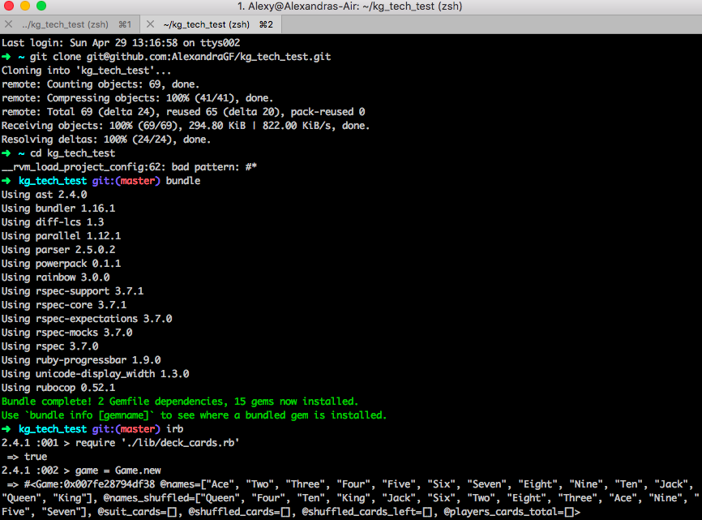

## Kurt Geiger Tech Test

## Scenario

```
You have a deck of 52 cards, comprised of 4 suits (hearts, clubs, spades and diamonds) each with 13 values (Ace, two, three, four, five, six, seven, eight, nine, ten, jack, queen and king).
There are four players waiting to play around a table.
The deck arrives in perfect sequence (so, ace of hearts is at the bottom, two of hearts is next, etc. all the way up to king of diamonds on the top).
The task is a simple one. Please create a simple command line program that when executed recreates the scenario above and then performs the following two actions:
Shuffle the cards - We would like to take the deck that is in sequence and shuffle it so that no two cards are still in sequence.
Deal the cards - We would then like to deal seven cards to each player (one card to the each player, then a second card to each player, and so on)
There is no need to necessarily do this in a visual way (for example, simply proving with a test that your deck is shuffled and that the players do now have seven cards will be sufficient)
```

### User Stories

```
As a user
So I can start the game with a complete deck in order
I want to be able to have all the cards in order (ace of hearts is at the bottom, two of hearts is next, etc. all the way up to king of diamonds on the top).
```
```
As a user
So I don't have any two cards are in sequence
I want to be able to shuffle the cards.
```
```
As a user
So I can play the game with other players
I want to be able to deal 7 cards to each player.
```

## Run the deck cards game

1. Open your terminal and clone this repository
```
git clone git@github.com:AlexandraGF/kg_tech_test.git
```

2. Change directory by typing ```cd kg_tech_test``` and then  ``` bundle ```

3. Open IRB by typing ```irb``` on you terminal.

4. Type the following commands, one at a time and press enter after each one:
```
require './lib/deck_cards.rb'
```
```
game = Game.new (you start a new game)
```
```
game.complete_deck_order (you make sure all the cards are in the correct order at the start of the game)
```
```
game.shuffle_deck (you shuffle the cards, so they are not in sequence)
```
```
game.deal_cards_game(4)  (you enter a number of player, for example 4, and then 7 cards will be given to each of the players. Therefore, 4 players, each having 7 cards, 28 cards will be dealed.)
```
5. By typing ``` game.players_cards_total ``` will show you each player's cards.

6. Type ``` game.shuffled_cards_left ``` to see the remaining cards that can be played.

7. Type ``` game.shuffled_cards_left ``` to see the number of cards left to play.

8. When you want to finish the session, type ```exit``` on your terminal

## Screenshoot from running the game in the terminal:




## Tests running green

On your terminal, type ``` rspec ``` and the tests will run.


